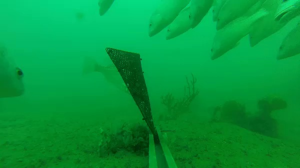

# Advanced Deep Learning with PyTorch

In this advanced excercise, the instructions will be a little more vague and you'll need to go figure find out much on your own, part of the learning and challenge.

_Why do this task_:  Usually, beginner tutorials around ML and neural networks begin with classifying hand-written digits from the MNIST dataset or CIFAR-10.  We are going to begin with something more challenging and much of it will be dealing with data, labeling and data formats.  This is to simulate how life will likely be in real life and it's hoped you will learn how to create machine learning models more effectively and quickly in the real world. The reason to work through the following is:

  * It will force you to read and learn from scratch.  You will learn the different label file formats, deserializers and how things compute. 
  * For for example, in energy/manufacturing you will get .png or .jpg or .tiff files and not stuff already in the perfect format.  You may even get video data.
  * Learning this will help you understand the concept of “Data Packing”. 
  * This is not the simplest way, but it forces greater learning.

## Working with PyTorch on More Complex Data

See [Setup](/navigating-ml/setup) for more instructions on how to

> _In the real world, data is rarely so uniform and simple pixels will not be suitable: this has led to a large literature on feature extraction methods for image data._

### Image Classification

Start with raw video of fish swimming at a video trap in the northern territories of Australia.

Sample image:

1. Download the video sample from here: https://github.com/Azadehkhojandi/FindingFishwithTensorflowObjectdetectionAPI/blob/master/fish_detection/fishdata/Videos/video1.mp4
2. Separate the video input into individual frames and then separate the frames into a 'fish' or 'no fish' folder with manual (time consuming) or automated inspection (use pre-built APIs).

> An automated intial pass could be done with the Microsoft Computer Vision API or, even, Custom Vision (w/ free tiers).  An exmaple of using the Computer Vision API for this task may be found in <a href="https://github.com/Azadehkhojandi/computer-vision-fish-frame-proposal/blob/master/classify_and_get_object_frames.py" target="_blank">this script on GitHub</a> (with good instructions on getting access to the API on the Readme).    
This API may not perform well on the raw images, however - can you see why?  How could they be transformed?  Now let's create our own model.
3. Create your own classifier in PyTorch to classify frames as fish/no fish using the parsed data, now in proper folders.
4. Use `transforms` modules from `torchvision` and other libraries to:
    * Try out some data augmentation - (e.g. random vertical flip and blur the images) as well as the more standard "good idea" normalization.
5. Make sure you also create an example for [inference](https://en.wikipedia.org/wiki/Statistical_inference).
6. Use Scikit-learns’s confusion matrix and classification_report to generate metrics.
    1. [Scikit-learn's confusion matrix](http://scikit-learn.org/stable/modules/generated/sklearn.metrics.confusion_matrix.html)
    2. [Scikit-learn's classification report](http://scikit-learn.org/stable/modules/generated/sklearn.metrics.classification_report.html)

### Object Detection

Use the Out of Box Faster-RCNN or YOLOv3 solution to identify fish in frames and, for this, you will need to label with bounding boxes - good tools are <a href="https://github.com/Microsoft/VoTT" target="_blank">VoTT</a> and <a href="http://www.robots.ox.ac.uk/~vgg/software/via/" target="_blank">VGG Image Annotator</a>

## Additional Help

* PyTorch forums - [Ref](https://discuss.pytorch.org/)
* StackOverflow with `pytorch` tag

## Credit

Thank you to David Crook for providing the initial wording for the excercise intro.
