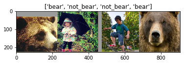

# Intermediate Practice with Deep Learning

It is recommended that you have completed the [Level 2 Preparation](/navigating-ml/level2_prep).

In this intermediate set of problems, you'll apply what you've learned in the Level 2 Preparation section.  You'll utilize your bear and COCO dataset with an MLP and CNN in PyTorch, including and introduction to transfer learning.

## Adapt a Multilayer Perceptron and CNN

### Image Classification

Instructions to practice image classification with PyTorch

#### Setup

Let's dive into some data and code.  Open a Jupyter session or log into the Jupyter system
  - In a code cell `! git clone https://github.com/rasbt/deep-learning-book.git`
  - Navigate to this directory:  `/code/model_zoo/pytorch_ipynb` where we will operate.

#### Data

We will work with your square-padded bears dataset from Level 1 (if you do not have these, go to Level 1 and set up the datasets) and a similar number of the square-padded COCO images (ones that are not images of a bear, of course - remove any that are here because there are some sneaky bears in COCO).

  * Set up the following data folder structure where the notebooks live:
  ```
  data/train/bear
  data/train/not_bear
  data/test/bear
  data/test/not_bear
  ```
  * Place all, but 5 of the square-padded images of bears, into `data/train/bear`.  Place all but 5 square-padded images of non-bear from a subset of COCO, into `data/train/not_bear`.
  * Place the remaining bear images into the `data/test/bear` and likewise with the non-bear images, but into `data/test/not_bear`

#### Train a Multi-Layer Perceptron

  - Open the `multilayer-perceptron.ipynb` notebook
  - Modify the notebook in the right places to work with your bear dataset - check out the usage of torchvisions `datasets.ImageFolder` (<a href="https://pytorch.org/tutorials/beginner/transfer_learning_tutorial.html#load-data" target="_blank">Example</a>) for easily creating a PyTorch-compatible dataset based on folder structures upon which the data loaders can work (the folder structures serve as the labels!).
  - Make sure to add `transforms` to "Resize" the input.  Try out other transforms as well as you go along to see if there are improvements in the accuracy.

> Most deep learning frameworks have their own dataset formats - often several.  PyTorch has many standard readers for data as well as an object oriented guideline to create custom datasets that work with the PyTorch data loaders.  It can thus be very flexible.

* Look at the mathematical notations in the notebook in the model definition to figure out the final FC layer size - you will see errors otherwise.
* A few other hyperparameters may need to be looked at.


#### Train a CNN (VGG16)

- Do the same as above, but with the `convnet-vgg16.ipynb`.

VGG16 has the following architecture (VGGNet was the runner-up of the ILSVRC 2014 competition, a.k.a., the ImageNet challenge).


Add the following transform to the `train` and `test` dataset instantiation.

```python
transform=transforms.Compose([transforms.Resize(32),
                                                                  transforms.ToTensor(),
                                                                  transforms.Normalize(mean=[0.485, 0.456, 0.406],
                                                                     std=[0.229, 0.224, 0.225])])
```

- Why are we resizing to 32x32 pixels?
- Wny is the test accuracy so low in the above cases?
- How would you modify the network in the case of 228x228 3-channel input (say you Resize to 228)?

## Transfer Learning with PyTorch



Transfer learning can address the issue of small datasets by starting with pre-trained weights, weights that get us closer to recognizing objects that we are wishing to classify, instead of starting with random weights on our parameters.  

> Note, if your objects differ significantly from the objects upon which the pre-trained network was originally trained (usually ImageNet or COCO), some more data may be needed as well as potentially unfreezing more layers for fine-tuning.

Modify <a href="https://pytorch.org/tutorials/beginner/transfer_learning_tutorial.html" target="_blank">this</a> PyTorch tutorial to work with VGG16 and the bear/not_bear dataset you have come to enjoy.  You may need to take a look at the layers of VGG16 found in the following, to decide how to modify the last layer for different output size (i.e. different number of classes).  

Note, the `model_object.classifier` is actually a sequential list of fully connected layers (see diagram above).  Also, to see this classifier defined, you can take a look at:

```python
model_object.classifier._modules
```

Additionally, defining a new layer will have a grad function and gradients enabled by default for backprop.  What must you do to freeze the layers before the last layer so that you are only fine-tuning on that last layer?

Once you've worked out the updates, train the model on your bear/no bear data.

* How much has the result improved?
* If you wished to "unfreeze" more than the last layer, how would you do so?
* If you had 3 classes instead of 2, how would you modify the network architecture?

## Additional Help

* PyTorch forums - [Ref](https://discuss.pytorch.org/)
* StackOverflow with `pytorch` tag
