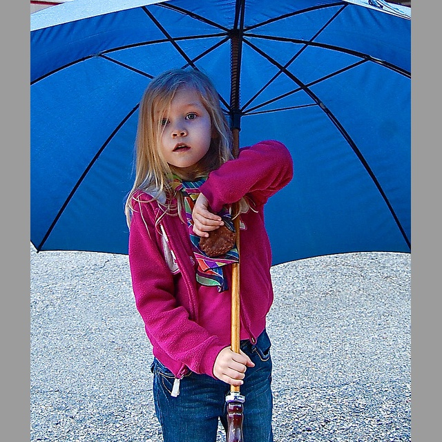
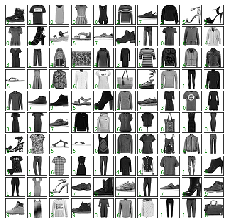
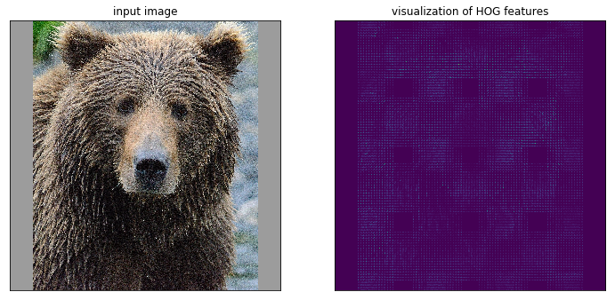
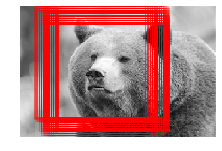

# Going from Prebuilt ML Tools to First Custom ML

It is recommended that you have completed the [Level 1 Preparation](/navigating-ml/level1_prep).

In this first set of practice problems you'll learn about basic ML and neural networks, hands-on, with Jupyter notebooks and Python.  You'll be introduced to `scikit-learn` and PyTorch as Python packages commonly used in data manipulation and data science.  

Here and throughout these practice exercises you'll work with the following image datasets: COCO, Fashion MNIST, the Hymenoptera insect and a few custom ones you create.

## First ML with Custom Vision Service

1. Download the COCO 2017 Val dataset (1 GB) [here](http://cocodataset.org/#download) to get a set of real-life images (click on "2017 Val images [5K/1GB]").

2. Pick 50-100 images to upload, some with people and some without (create a balanced dataset).

2. Build a person/no-person image classifier using Microsoft's [https://customvision.ai/](https://customvision.ai/) (choose "multiclass" classification using the "general" domain) - directions on the [Docs](https://docs.microsoft.com/en-us/azure/cognitive-services/custom-vision-service/getting-started-build-a-classifier) page.

2. Observe performace metrics under the "Performance" tab.


> Some defintions.  **Precision**:  if a tag is precicted by your classifier, how likely is it that it is right?  **Recall**:  out of the tags that should be classified as right, what percentage did your classifier correctly find?

3. Square-pad all of the images and build a new classifier under a new project in Custom Vision.

Original:

<br>

Square-padded by expanding:




* How do the performance metrics change?  Did they get worse or better and why do you think that is?

## First Custom ML (Open Source Tools)

For these two problems, it is recommended to go through the code from the original source line by line in whatever fashion you see fit so that you really understand what is going on.

TIPS:  Place all imports at the top of the notebook.  Call the training data something consistent thoughout all of your work (X_train -> training data, y_train -> labels, X_test -> test data...).

### Image Classification with Classical ML



Create a Python program to classify images from Fashion MNIST Dataset (get [here](https://github.com/zalandoresearch/fashion-mnist)) leveraging code samples from the Python Data Science Handbook - [Ref](https://jakevdp.github.io/PythonDataScienceHandbook/05.02-introducing-scikit-learn.html#Application:-Exploring-Hand-written-Digits).  

Refer to Chapter 2 and 3 of the Python Data Science Handbook for information on data manipulation in Python if not already familiar.

Do this in a Jupyter notebook (any service or locally) - recall you learned about this tool in the [Setup](/navigating-ml/setup) section.

Steps:

- Visualize a sample of 50-100 images with labels
- Try fitting a Gaussian naive Bayes model.  How does it compare results found in the Handbook for the MNIST Digits datset (a black and white 8x8 pixel dataset of handwritten digits)?

Additionally:

- Which fashion item has the best accuracy, which the worst?  Use a confusion matrix.  Why do you think that is?  Is there a way you could imagine improving this model?
- Normalize the images (in `sklearn`) and check the accuracy of the model(s) again.  Did it improve or worsen?
- Try a different model - SVM or Random Forest

### Image Classification with Basic Neural Nets

The purpose of the Basic Neural Nets exercises are to familiarize you with how a simple artificial neuron works all from the ground-up - this knowledge will serve you well.  See [Level 1 Preparation](/navigating-ml/level1_prep) for more information.

3. Adapt a from-scratch Perceptron as in this [Jupyter notebook](https://github.com/rasbt/python-machine-learning-book-2nd-edition/blob/master/code/ch02/ch02.ipynb) to train and 
test on the Fashion MNIST dataset.

    * Does the model converge or not (plot the training and validation error)?

4. Adapt a from-scratch Multilayer Perceptron (MLP) as in this <a href="https://github.com/rasbt/python-machine-learning-book-2nd-edition/blob/master/code/ch12/ch12.ipynb">Jupyter notebook</a>

    * Try it again with the `scikit-learn` MLP class.
    * Does the model converge now?  What accuracy does the model achieve?

### Object Detection with Histogram of Oriented Gradients

Create a Python program to detect bear faces (perhaps you're builing a bear watch app for safety in the woods) by leveraging code samples from this <a href="https://jakevdp.github.io/PythonDataScienceHandbook/05.14-image-features.html" target="_blank">Python Data Science Handbook notebook</a>.  



*  Collect 50-100 images of bear faces from the web and square-pad them as done for the COCO images above.  In addition, resize them to the same shape (228x228 for example).  Observe, that in the code sample, the shape of the final image data for training will be (100, 228, 228) if 100 samples are collected.  These constitute the "positive" training samples.

An example of the image pre-processing (padding is up to you):

```python
data_array = []

# Get image files
img_files = glob.glob('../../data/bears_pad/*.*')

for img in img_files:
    im = Image.open(img)
    # Resize to uniform size
    im = im.resize((228, 228))
    # Convert to only grayscale in case of an alpha channel
    im = im.convert('L')
    im = np.asarray(im)
    data_array.append(im)

# Convert collection to numpy array
positive_patches = np.asarray(data_array)
positive_patches.shape
```

The rest of the steps are outlined as follows (as described in the Handbook):

- Obtain a set of image thumbnails of non-faces to constitute "negative" training samples.
- Extract HOG features from these training samples.
- Train a linear SVM classifier on these samples.
- For an "unknown" image, pass a sliding window across the image, using the model to evaluate whether that window contains a face or not.
- If detections overlap, combine them into a single window. 

Additionally:

- What other confounding factors are there for images other than illumination, you think?
- Plot the original image along with the `skimage.rgb2gray` version and the HOG representation.  See how this works in `matplotlib`.  What does `skimage.rgb2gray` actually do?
- Try out the model on the entire test image.  What do you find out?

A cursory result might be (after varying window sizes):


- Try using sliding windows with a variety of sizes (and aspect ratios).  What do you find out?
- Augment the data to expand the training and test datasets (e.g. use a library like `imgaug` to left-right flip, blur, contrast normalize, etc.) and retrain and test.  How does the performance change and why is that?
- **Extra credit**:  Implement Non-Maximum Suppression in Python to find the single best bounding box of a group of bounding boxes as are found above.  Apply this to the test image.


## Additional Help

- StackOverflow with `sklearn`, `jupyter`
- For Custom Vision you can email customvisionteam@microsoft.com.
